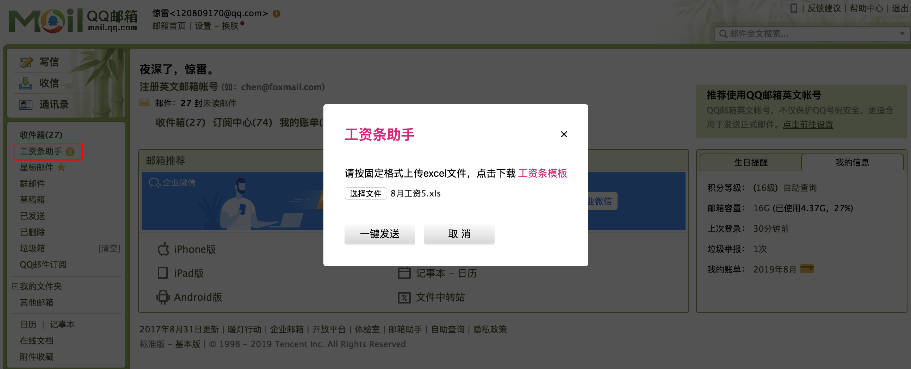

# MailExtension
a chrome extension for sending monthly salary pay-stub emails

### 需求
前几天老婆大人提起，她有一位HR同事发送工资条很是痛苦。由于公司人数较多，手动发送邮件很是浪费时间，且容易出错。经过一番调研，发现Chrome插件的开发成本较低，而且对普通用户更加友好。

### 实现
chrome extensions允许在指定页面中注入js脚本(content_scripts)，这些脚本可以修改”宿主“页面的UI，加入新的业务逻辑等等。与此同时，content_scripts发起网络请求时，可以共享宿主的cookie等信息。也就是说，我们写邮件插件，模拟发起post请求时，chrome会自动在URL请求中塞入Cookie等header信息。

### 效果
目前可以支持QQ邮箱群发支持：  

支持163邮箱：  

支持126邮箱：  

支持263企业邮箱：  

### 第三方库
[Micromodal](https://github.com/ghosh/Micromodal) 
[toastr](https://github.com/CodeSeven/toastr) 
[js-xlsx](https://github.com/SheetJS/js-xlsx)
